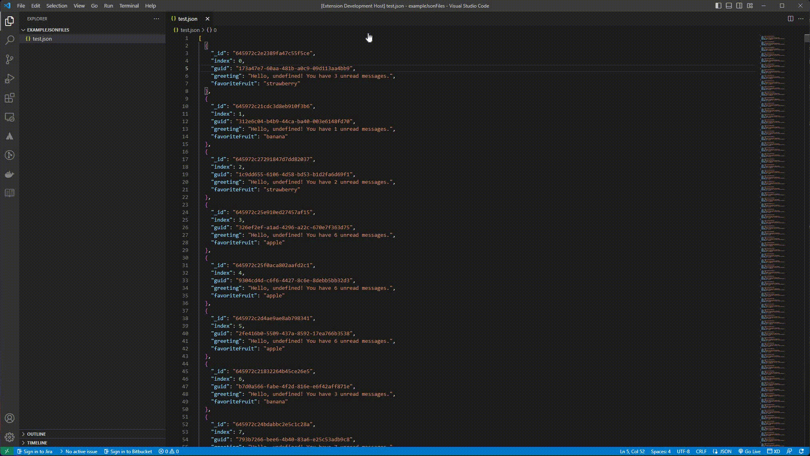

# json-keys-remover README

Visual Studio Code extension that will remove all occurrences of selected keys from JSON file.

---
## Features



## Requirements
```sh
 $ npm install
```
 
  To install dependencies inside the project

## How to work properly
1. Json file opens
2. Select the json parse command from the command palette. The command plate closes automatically.
3. Json file is cached and Json parsed message is shown to user
4. The list of keys parsed in Quick Pick is displayed.
5. User selects one or more keys and presses OK button
6. Keys selected from the cached Json file are deleted and replaced with the original json file.

## Error Handling
For example, if an incorrect json file is tried to be parsed, the way it works is as follows.
1. An incorrect json file is opened
2. Select the json parse command from the command palette. The command plate closes automatically.
3. An error message "incorrect json format" is shown to the user

For example, if a file different from the json file is tried to be parsed, the way it works is as follows.
1. An incorrect file is opened
2. Select the json parse command from the command palette. The command plate closes automatically.
3. An error message "Active file is not a json file" is shown to the user

---
## Run Extension 

* Open the debug viewlet (`Ctrl+Shift+D` or `Cmd+Shift+D` on Mac) and from the launch configuration dropdown pick `Run Extension`.
* Press `F5` to run the tests in a new window with your extension loaded.

## Extension Tests (Unit Test)

* Open the debug viewlet (`Ctrl+Shift+D` or `Cmd+Shift+D` on Mac) and from the launch configuration dropdown pick `Extension Tests`.
* Press `F5` to run the tests in a new window with your extension loaded.
* See the output of the test result in the debug console.
* Make changes to `src/test/suite/extension.test.ts` or create new test files inside the `test/suite` folder.
  * The provided test runner will only consider files matching the name pattern `**.test.ts`.

## Install Manually

1. Find the folder where extensions are installed. On windows, it is in: C:\Users\USER_NAME\.vscode\extensions. 
2. Copy and transfer the extensions to the target computer, in the extensions folder.
3. Restart the VSCode to see the extensions.
