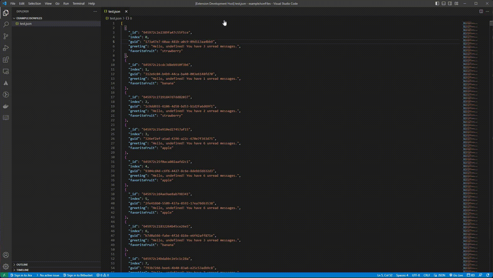

# VS Code JSON Keys Remover Extension

This extension removes all the selected keys (properties) from the JSON.

# Index

- [Demo](#demo)
- [How it works](#how-it-works)
- [Release Notes](#release-notes)

## DEMO

To install dependencies inside the project

## How it works

1. User opens a JSON file.
2. User enters command (JSON Keys Remover: Remove Keys) using Command Palette.
3. Extension displays unique keys/properties (with complete path) of JSON object in Quick Pick.
4. The list of keys parsed in Quick Pick is displayed.
5. User selects keys (by checking checkboxes) to remove and clicks "OK" button.
6. Extension updates the opened JSON file after removing all occurrences of selected keys from JSON object.

## Release Notes

This section describes major releases and their improvements.

### Version 0.1.0 - initial release

Added a command ("JSON Keys Remover: Remove Keys") to remove selected keys/properties from the JSON object.
